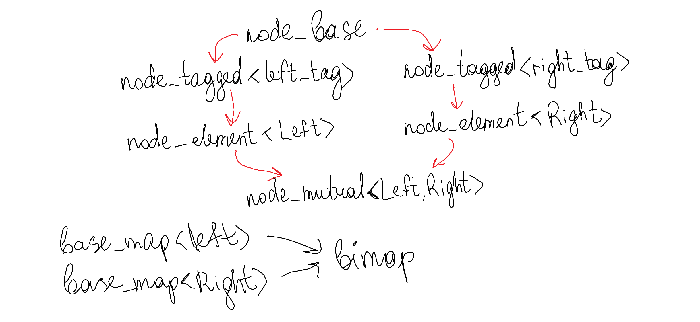
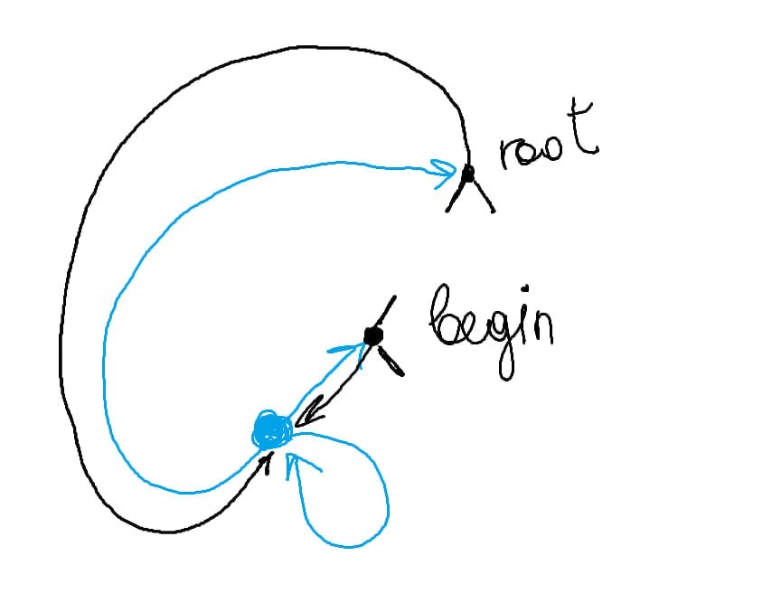

# Bimap

Структура данных, описывающая биективную функцию. Позволяет получать как значение по ключу, так и по значению единственный соответствующий ему ключ.

## Устройство структуры:

**Структура ноды:**

`node_base -> node_tagged -> node_element -> node_mutual`
`node_base` - базовый функционал
`node_tagged` - шаблон с типом, показывающим "сторону" (ключ (left) или значение (right))
`node_element` - хранит значение
`node_mutual` наследуется от двух node_element (left и right), этот тип имеет обычная нода в дереве.

**Для sentinel:**
`node_base -> node_tagged -> node_empty_mutual`
sentinel имеет тип `node_empty_mutual`.
`node_empty_mutual` наследуется от двух `node_tagged` и нужен только для `end().flip()`

**Sentinel** устроен как показано на рисунке (отмечен синим)

Такое расположение позволяет:
1) циклически итерироваться по дереву без частных случаев (см. функцию step в итераторах)
2) получать begin за O(1).
3) получать root за O(1)
